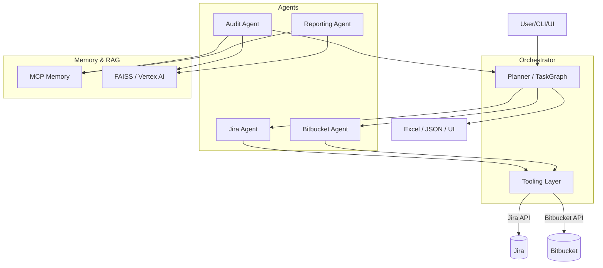

# Agent Orchestration

```mermaid
flowchart TB
  subgraph Orchestrator
    Plan[Planner / TaskGraph]
    Tools[Tooling Layer]
  end

  subgraph Agents
    A1[Jira Agent]
    A2[Bitbucket Agent]
    A3[Audit Agent]
    A4[Reporting Agent]
  end

  subgraph Memory & RAG
    MCP[MCP Memory]
    VDB[FAISS / Vertex AI]
  end

  User[User/CLI/UI] --> Plan
  Plan --> A1
  Plan --> A2
  A1 --> Tools
  A2 --> Tools
  Tools -->|Jira API| JiraCloud[(Jira)]
  Tools -->|Bitbucket API| BBCloud[(Bitbucket)]
  A3 --> Plan
  A3 --> MCP
  A3 --> VDB
  A4 --> MCP
  A4 --> VDB
  Plan --> Output[Excel / JSON / UI]
```
