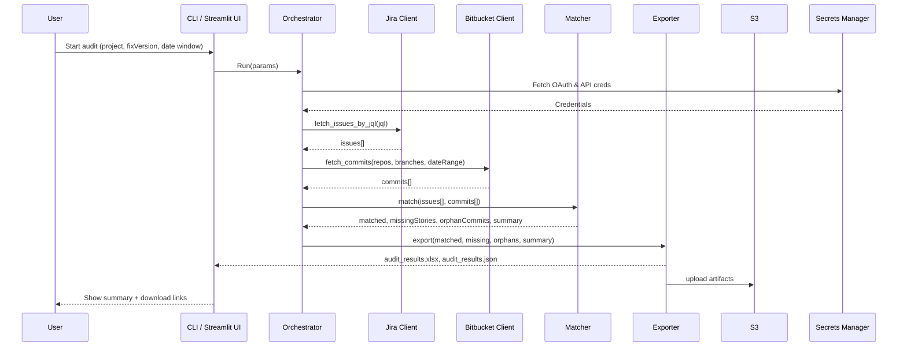

# End-to-End Data Flow

```mermaid
sequenceDiagram
  participant U as User
  participant CLI as CLI / Streamlit UI
  participant OR as Orchestrator
  participant JC as Jira Client
  participant BC as Bitbucket Client
  participant M as Matcher
  participant EX as Exporter
  participant S3 as S3
  participant SEC as Secrets Manager

  U->>CLI: Start audit (project, fixVersion, date window)
  CLI->>OR: Run(params)
  OR->>SEC: Fetch OAuth & API creds
  SEC-->>OR: Credentials

  OR->>JC: fetch_issues_by_jql(jql)
  JC-->>OR: issues[]

  OR->>BC: fetch_commits(repos, branches, dateRange)
  BC-->>OR: commits[]

  OR->>M: match(issues[], commits[])
  M-->>OR: matched, missingStories, orphanCommits, summary

  OR->>EX: export(matched, missing, orphans, summary)
  EX-->>CLI: audit_results.xlsx, audit_results.json
  EX->>S3: upload artifacts

  CLI-->>U: Show summary + download links
```
