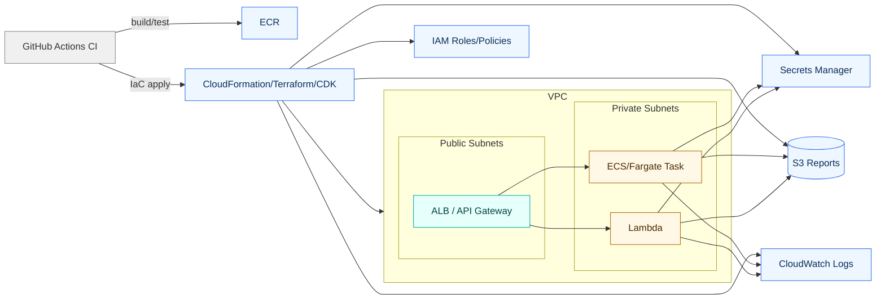

# AWS Deployment

```mermaid
flowchart LR
  subgraph VPC[VPC]
    subgraph PrivateSubnets[Private Subnets]
      ECS[ECS/Fargate Task]:::svc
      Lmb[Lambda]:::svc
    end
    subgraph PublicSubnets[Public Subnets]
      ALB[ALB / API Gateway]:::edge
    end
  end

  Dev[GitHub Actions CI]:::ext -->|build/test| ECR[ECR]:::aws
  Dev -->|IaC apply| CFN[CloudFormation/Terraform/CDK]:::aws
  CFN --> VPC
  CFN --> Secrets[Secrets Manager]:::aws
  CFN --> S3[(S3 Reports)]:::aws
  CFN --> Logs[CloudWatch Logs]:::aws
  CFN --> IAM[IAM Roles/Policies]:::aws

  ALB --> ECS
  ALB --> Lmb
  ECS --> Secrets
  Lmb --> Secrets
  ECS --> S3
  Lmb --> S3
  ECS --> Logs
  Lmb --> Logs

  classDef aws fill:#eef7ff,stroke:#2f6feb,color:#0b2e5a
  classDef svc fill:#fff8e6,stroke:#b26a00,color:#4a2c00
  classDef edge fill:#e6fffb,stroke:#0aa, color:#044
  classDef ext fill:#f0f0f0,stroke:#888,color:#333
```
